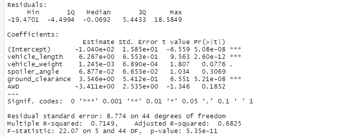
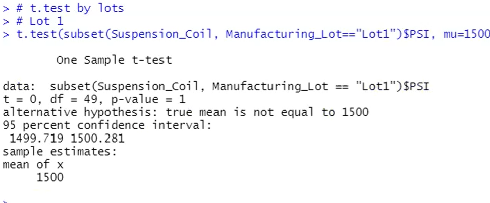
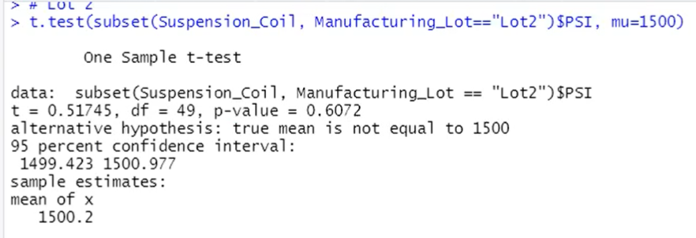
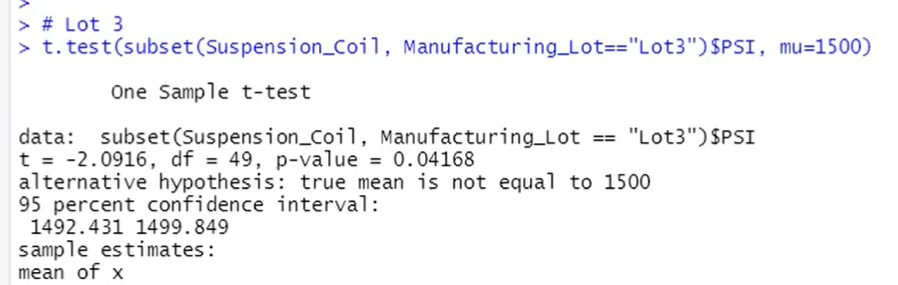

# Mechacar_Analysis

A few weeks after starting his new role, Jeremy is approached by upper management about a special project. AutosRUs’ newest prototype, the MechaCar, is suffering from production troubles that are blocking the manufacturing team’s progress. AutosRUs’ upper management has called on Jeremy and the data analytics team to review the production data for insights that may help the manufacturing team.

In this challenge, you’ll help Jeremy and the data analytics team do the following:

Deliverable 1: Perform multiple linear regression analysis to identify which variables in the dataset predict the mpg of MechaCar prototypes

   
    
    Q1. Which variables/coefficients provided a non-random amount of variance to the mpg values in the dataset?

    -Methodology: Each Pr(>|t|) value in the summary above represents the probability that each coefficient contributes a random amount of variance to the linear model.
     -A1. Using the MechaCar_mpg dataet, vehicle_length and ground_clearance (as well as intercept) are statistically unlikely to provide random amount of variance to the linear model. In other words the **vehicle_length and ground_clearance have a significant impact on mpg**.

    Q2. Is the slope of the linear model considered to be zero? Why or why not?
        -Methodology: Examine the Pr(>|t|) value in the  summary above for the (Intercept)
        -- A2. ** The intercept is statistically significant ** (less thatn the 0.05)** and not zero**. This would indicate that the intercept term explains a significant amount of variability in the dependant variable when all independent variables are equal to zero. It could mean that the signficant features (such as vehicle_eight and ground_clearance) may need scaling or transforming to help improve the predictive power of th emodel; or there are other variables that can help explain the variability of our dependent variable (mpg) that have not been included in our model

    Q3. Does this linear model predict mpg of MechaCar prototypes effectively? Why or why not?
    - A3 The **Multiple R-squared value is .071** (while the p-value remained significant (very small) **indicating the model does an adequate job of predicting mpg**)

Deliverable 2: Summary Statistics on Suspension Coils
 Collect summary statistics on the pounds per square inch (PSI) of the suspension coils from the manufacturing lots
 
 
 
  

 Q1. The design specifications for the MechaCar suspension coils dictate that the variance of the suspension coils must not exceed 100 pounds per square inch. Does the current manufacturing data meet this design specification for all manufacturing lots in total and each lot individually? Why or why not?
 Methodology: Examine the mean, median, and variance in total (total_summary) and for each lot (lot_summary) to determine if the variance is within the 100 pounds per square inch.
 A1: **In total, the specifications are met with variance of 62.29 (less than 100)**

 A2: **By Lots, Lots 1 & 2 are within specification; however Lot 3 has a variance that exceeds specification** 

Deliverable 3: Run t-tests to determine if the manufacturing lots are statistically different from the mean population

Deliverable 4: Design a statistical study to compare vehicle performance of the MechaCar vehicles against vehicles from other manufacturers. For each statistical analysis, you’ll write a summary interpretation of the findings.